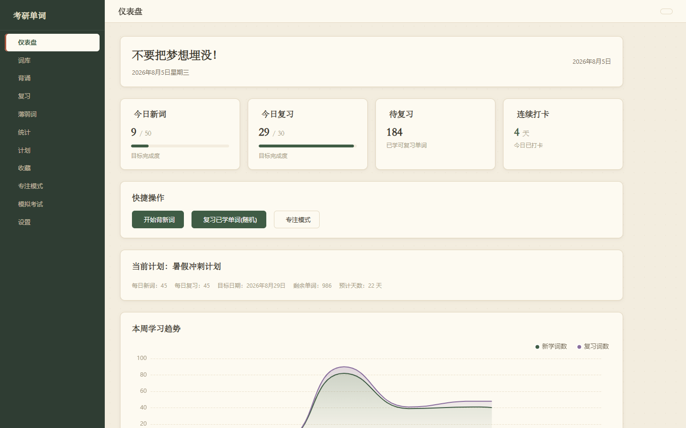
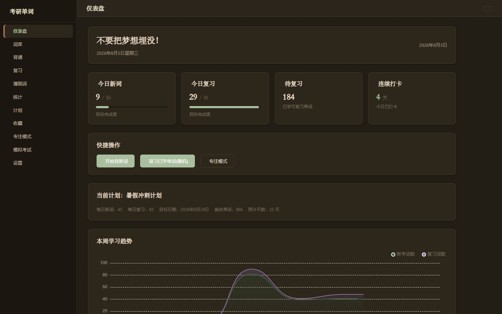

# 考研英语学习平台（v3.0.0）

基于 Django 的考研英语一体化学习 Web 应用，覆盖 **词汇背诵 · 复习巩固 · 写作工坊 · 真题模拟 · AI 智能辅助 · 音乐与资料库**，开箱即用。

> **一句话介绍**：这是一个考研英语学习软件，帮你**先背单词、再写作文**，全程有 AI 助教。
>
> 1. **背单词**：按单元背诵、自动安排复习、收集薄弱词重点练，AI 还能编记忆口诀，每天打卡有成就感。
> 2. **写作文**：系统会记录你已掌握的词汇；AI 用这些词帮你写范文、批改打分，并生成**专属于你的作文模板**（高分句型、易错点、词汇升级卡）。
>
> 一句话：**积累的词汇越多，AI 生成的范文和模板就越贴合你的水平**，形成你自己的写作套路。





## 功能特性

### 📚 词汇学习
- **词库管理**：单元 CRUD、索引查询、分页（词源红宝书，完整词库需自行导入）
- **背诵与复习**：顺序/乱序背诵、随机复习、永不忘记标记、拼写检测、释义默写（AI 判定）、笔记、AI 速记（拆分/谐音/联想口诀）
- **薄弱词**：自动汇总易错词，综合评分精选 50 个重点突破
- **收藏词汇**：随时收藏重点词，集中温习

### ✍️ 考研写作工坊（历年真题）
- **完整真题库**：英语一/二 2006-2026 年小作文、大作文、翻译真题（当前 110 条）
- **AI 代写**：自动读取你已掌握的词汇画像，生成贴合当前词汇水平的作文（基础/标准/拔高三档）
- **AI 批改**：词汇 / 语法 / 连贯 / 切题 / 丰富度五维评分 + 逐句改错 + 高级表达推荐
- **翻译专项**：长难句语法拆解、词汇点拨、译文 AI 批改
- **命题规律分析**：基于历年真题 AI 归纳高频主题与常考题型
- **练习历史 & AI 调用日志**：完整留存历史练习记录与每次 AI 调用明细（模型、耗时、成败）

### 📊 学习管理
- **打卡日历**：每天学满 30 词自动打卡，GitHub 风格热力图
- **模拟考试**：可配置范围、题数、考试方式，交卷自动更新掌握状态
- **学习统计**：趋势图、正确率、周报（ECharts），AI 评语学习报告
- **学习计划**：每日新词/复习量、目标日期、单元范围、剩余天数估算

### 🤖 AI 能力
- **AI 小助手**：背诵/复习时调用 LLM 提问；独立 AI 聊天页（`/ai-chat/`）支持多会话与附件
- **AI 智能导入**：图片/文本/文件三种输入，三级复审（AI 自动修正 → 人工核对 → 随机抽审），断点恢复
- **模型集中管理**：设置页添加多个模型，为导入/速记/默写/小助手/写作工坊分别指定

### 🎨 视觉与娱乐
- **多主题**：暖纸浅色 / 清爽蓝白 / 复古牛皮 / 深夜书桌 / 星空午夜
- **自定义壁纸**：基于 IndexedDB 无大小限制上传多张壁纸，一键切换，界面随主题透明化
- **音乐库 & 播放器**：内置音乐库与全屏播放器，支持壁纸上传作为播放背景

### 🔧 工具与其他
- **PDF 资料库**：资料上传、在线阅读
- **数据安全**：JSON 备份/恢复、PDF 导出
- **分组导航**：侧边栏按词库 / 学习 / 分析 / 考试 / 工具分组

## 技术栈

Python 3.13 + Django 4.2 | SQLite | 原生 HTML/CSS/JS + ECharts + Phosphor Icons | IndexedDB

## 快速开始

```
pip install -r requirements.txt
python manage.py migrate
python manage.py runserver
```

浏览器打开 http://127.0.0.1:8000/

## AI 模型配置

进入 `/settings/` 页面，支持添加多个模型，为导入 / 速记 / 默写 / 小助手 / 写作工坊分别指定模型；未指定时自动使用第一个启用的模型。

## 项目结构

```
d:\word
├── manage.py
├── requirements.txt
├── vocab_project/      # Django 配置
├── words/              # 主应用（模型/视图/模板/静态资源）
│   ├── ai_exam_prompts.py   # 考研写作工坊提示词（词汇画像、作文、批改、翻译、命题分析）
│   └── templates/           # 页面模板（含写作工坊、音乐、资料库等）
├── data/               # 词库数据
└── backups/            # 备份目录
```
