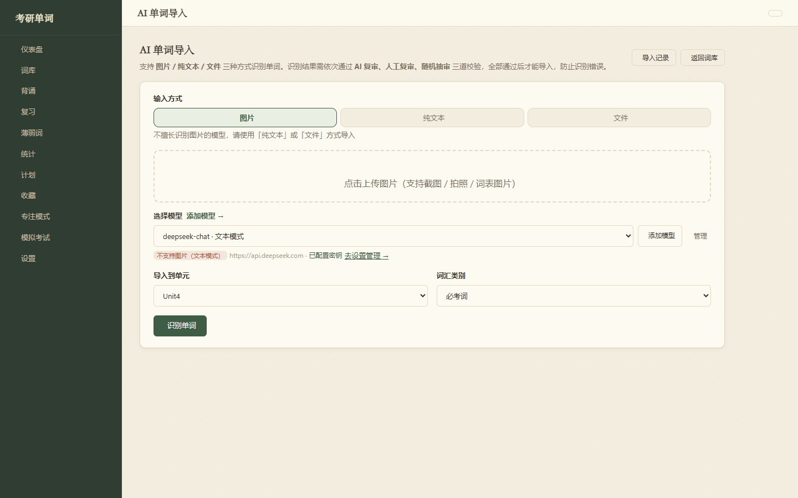
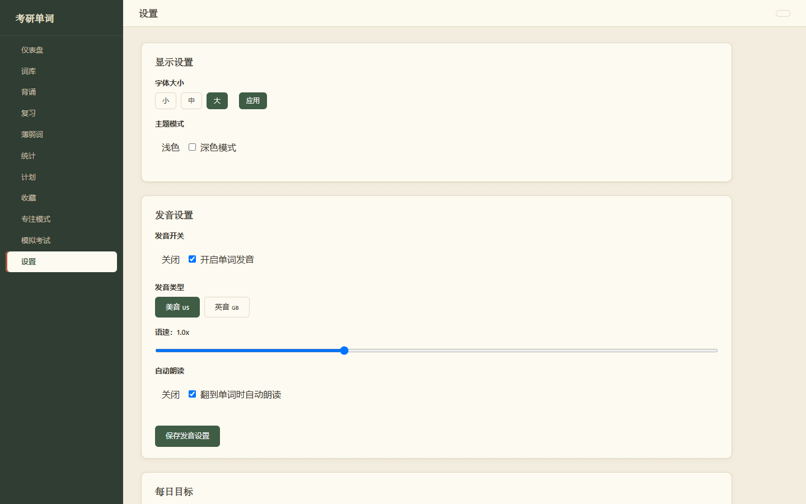

# 智能单词背诵平台（v2.0.0）

目前项目已完成多版本迭代，桌面版第一版已完成，可以使用 Windows PC 桌面版运行，后续将更新并修复 bug，如果你有更好的建议或反馈，欢迎交流！
快速上手直接把dist文件夹下载下来，然后点击.exe文件就可以使用。

# 目前项目已完成多版本迭代，项目正在上线测试中，后续 bug 修复将会继续上传更新，欢迎反馈问题或建议。
基于 Django 的考研词汇背诵 Web 应用，支持 AI 智能辅助背诵、词库管理、多模式背诵、模拟考试、学习统计，开箱即用（SQLite 本地存储，无需外部数据库，如需使用其他数据库请自行在 settings 里面更改配置）。


## 功能特性
为方便大家快速上手使用没有登录功能，所有功能都无需登录即可使用，后续可根据自己需求加上 JWT 相关功能。
- **词库管理**
  - 每个单元词库的 CRUD 操作，索引查询，分页等基础功能
  - 目前单词来源于考研界比较火的红宝书，本人亲自购买了一本并将里面部分单词使用 AI 导入到系统自行测试（未上线），仅供个人学习使用。为规范版权保护，完整词库不再上传，如有需要请自行购买红宝书上传进行自我使用
- **背诵与复习**
  - 顺序、乱序背诵，实时状态更新（未掌握 / 已掌握）
  - **随机复习**：随机抽取指定数量单词复习，已复习过的不再重复抽取
  - **永不忘记标记**：对非常熟练的词可主动标记「永不忘记」，标记后不再出现在背诵 / 复习中
  - **拼写检测**：看中文默写英文，自动判定，答错时逐字母标红错误位置
  - **释义默写**：看英文写中文意思，AI 判定正确 / 部分正确 / 错误（可在设置页切换为本地比对）
  - **笔记**：背诵时可以记笔记（后续将逐渐完善笔记功能）
  - **AI 速记**：三个模式中一键生成速记（拆分秒背 / 谐音 / 联想口诀），结果缓存到数据库，下次直接查看不再重复调用 AI，也可手动编辑或重新生成
- **薄弱词**（考前重点突破）
  - 自动汇总学过但未掌握、历史出错的单词，按「错误次数、是否掌握、掌握等级、近期表现」综合评分，精选最需巩固的 50 个
  - 顶部展示薄弱词总数、未掌握数、累计错误次数、已复习数，考前集中巩固
- **小助手（背诵 / 专注）**
  - 背诵时可以调用小助手，向 AI 提问单词考法、辨析、搭配、记忆技巧等（LLM 模型）
  - **独立 AI 聊天页**（`/ai-chat/`）：多会话管理，自动生成会话标题，支持附件
- **每日打卡（自动）**
  - 每天学满 30 个单词自动打卡，无需手动操作
- **单词打卡日历热力图**
  - GitHub 贡献网格风格
- **模拟考试**
  - 可配置考试范围、题数、考试方式
  - 交卷后自动更新单词掌握状态
- **学习统计**
  - 学习趋势堆叠光滑面积曲线图、正确率、每日打卡、新学 / 复习量统计（ECharts 图表，感谢可视化的夏teacher）
  - **学习报告**：每周日自动生成周报，含周期统计快照与 AI 评语（结合易错词、陌生词性给出针对性建议）
- **学习计划**
  - 每日新词数、每日复习量、目标日期、单元范围、剩余天数估算
- **AI 智能导入**

  - 三种输入方式：**图片识别 / 纯文本 / 文件**（某些模型识别不了图片时可改用文本或文件）
  - 支持多种模型：OpenAI 等（建议使用 DeepSeek 模型）

  - **识别进度实时显示**：文本 / 文件输入按行分批识别（每批 80 行），进度条 + 日志展示"第 X/N 批完成"及累计单词数；图片识别分阶段提示
  - **音标自动导入**：AI 识别时尽量给出美式音标，自动规范化格式（确保 `/ɪkˈspɔːrt/` 带斜杠），英式音标缺失时用美式填充
  - 三级复审防错机制：
    1. **AI 复审**：调用 AI 核对单词拼写、音标、词性、释义是否正确，发现错误**自动修正**并弹出修正报告（如"已修正：aborign → aborigine"）
    2. **人工复审**：逐条核对，可手动编辑
    3. **随机抽审**：随机抽样再次核对
  - **大批量复审支持进度条 + 日志输出**：AI 复审按批（每批 20 个）执行，实时显示"第 k/N 批完成"及发现 / 修正统计，避免单次请求超时
  - **断点恢复**：识别结果和复审进度自动保存草稿到 localStorage，刷新 / 关闭页面后可恢复继续
- **数据安全**
  - 词库 JSON 备份 / 恢复（`backups/` 目录）
  - 词库 PDF 导出
## 技术栈
- Python 3.13 + Django 4.2
- SQLite（零配置）
- 原生 HTML / CSS / JS，ECharts 图表，Phonetic 在线发音

## 快速开始
默认 Python 环境已安装，如未安装请安装 Python 环境并将其配置到环境变量中。
首次使用先安装依赖：

### 方式一：桌面版 exe（推荐，无需装 Python）

- 整个 `dist/VocabApp/` 文件夹就是软件本体，拷贝到任意 Windows 10/11 64 位电脑，双击 `VocabApp.exe` 即可使用。
- 首次运行会自动把内置数据库复制到用户数据目录 `%APPDATA%\VocabApp`，之后的学习数据都保存在那里，升级软件不丢数据。
- 启动后会自动打开浏览器进入系统，默认地址为 <http://127.0.0.1:8010/>；**关闭弹出的黑色窗口即退出程序**。
- **联网提示**：AI 功能（小助手、AI 导入、AI 速记）和在线发音需要联网，其余功能离线也能正常使用。
- 改动代码后重新打包：先安装打包依赖 `pip install -r requirements-build.txt`，再在项目根目录依次执行 `python make_seed_db.py`和 `pyinstaller vocab_app.spec --noconfirm`，新产物在 `dist/VocabApp/`。

### 方式二：源码运行（需要 Python 3.13）

1. 安装依赖：
   ```
   pip install -r requirements.txt
   ```
2. 启动：
   ```
   python run_desktop.py
   ```
   或传统方式 `python manage.py runserver`，然后浏览器打开 <http://127.0.0.1:8000/>。

也可以直接用 AI 编程工具打开项目，输入"启动项目"。

为了节省你的时间，请使用你的 AI 编程工具，输入"启动项目"，即可启动项目。
## AI 模型配置
进入 `/settings/` 页面进行操作设置。
支持添加多个模型，并为「导入识别 / 复审、速记生成、释义默写判定、小助手」分别指定使用的模型（不指定时自动使用第一个启用的模型）。
## 项目结构
```
d:\word
├── manage.py
├── run_desktop.py           # 桌面版启动入口（打包 exe 用）
├── make_seed_db.py          # 生成"仅词库"种子数据库（打包前运行）
├── vocab_app.spec           # PyInstaller 打包配置
├── requirements.txt        # Python 依赖（pip install -r requirements.txt）
├── vocab_project/          # Django 项目配置
│   ├── settings.py         # 数据库配置（db.sqlite3）
│   └── urls.py
├── words/                  # 主应用
│   ├── models.py           # 数据模型（单词/进度/计划/打卡/周报/会话等）
│   ├── views.py            # 页面视图 + 全部 API
│   ├── ai_prompts.py       # AI 提示词集中管理
│   ├── urls.py
│   ├── templates/          # HTML 模板
│   ├── static/             # CSS / JS / ECharts
│   └── management/commands/
│       ├── import_words.py         # JSON 词库导入
│       ├── import_text.py          # 纯文本导入
│       ├── generate_examples.py    # AI 批量生成例句
│       └── optimize_pos_meanings.py # AI 按词性归类释义
├── data/hongbaoshu.json    # 内置考研词库数据（示例）
├── backups/                # 备份文件目录（设置页下载备份生成）
├── db.sqlite3              # 数据库（开发模式，含个人数据，不入库）
├── packaging/db.sqlite3    # 打包用种子数据库（仅词库，由 make_seed_db.py 生成，不入库）
└── dist/VocabApp/          # 打包产物：桌面版 exe（可以直接分发）
```
## 数据备份
- 页面内「导出备份」生成 JSON 到 `backups/` 目录，可随时「恢复备份」
- 也可直接复制 `db.sqlite3` 文件备份
- 桌面版 exe 的数据在 `%APPDATA%\VocabApp`，直接复制里面的 `db.sqlite3` 即可备份
- **隐私说明**：exe 内置的种子数据库只含词库，不含个人学习数据和 API Key；打包前请先运行 `python make_seed_db.py` 重新生成，避免把个人数据带进软件包

## 欢迎各位考研人使用 不要把梦想埋没
